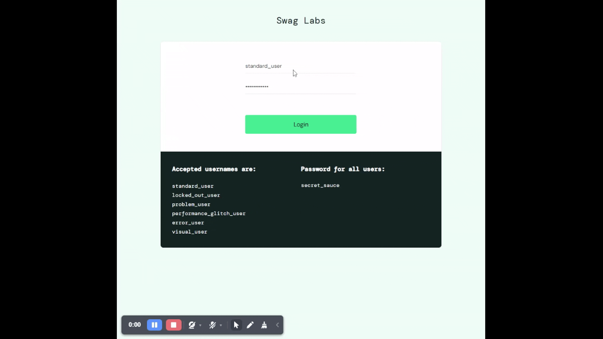

# BUG-01: Login Fails When Credentials Contain Trailing Whitespace

## Bug Metadata

| Field                | Value               |
| -------------------- | ------------------- |
| **Status**           | 🔴 Open             |
| **Reported By**      | Afope               |
| **Date Created**     | 2025-12-14          |
| **Last Updated**     | 2025-12-14          |
| **Severity**         | 🟡 Medium           |
| **Priority**         | P2                  |
| **Affected Feature** | User Authentication |
| **Bug Type**         | Input Validation    |
| **Tracability**      | TC-LOGIN-005        |

## Environment Details

| Component            | Version/Details           |
| -------------------- | ------------------------- |
| **Browser**          | Brave 1.84.141            |
| **Operating System** | Windows 11                |
| **URL**              | https://www.saucedemo.com |
| **User Account**     | `standard_user`           |

## Preconditions

- User is on the [Home Page](https://www.saucedemo.com/)

## Test Data

```
Username: `standard_user `
Password: `secret_sauce`
```

## Steps to Reproduce

### Expected Behaviour

| Step | Action                                                                   | Expected Result                                                                             |
| ---- | ------------------------------------------------------------------------ | ------------------------------------------------------------------------------------------- |
| 1    | Enter `standard_user ` (with trailing space) into the **Username** field | **Username** field displays the entered text correctly with trailing whitespace **trimmed** |
| 2    | Enter `secret_sauce` into the **Password** field                         | **Password** field displays the entered text correctly with no errors (masked)              |
| 3    | Click the **Login** button                                               | User is navigated to the `Inventory Page` and full product list is displayed                |

### Actual Behaviour

| Step | Action                                                                 | Actual Result                                                                                       |
| ---- | ---------------------------------------------------------------------- | --------------------------------------------------------------------------------------------------- |
| 1    | Enter `standard_user ` with trailing space into the **Username** field | **Username** field displays the entered text correctly with trailing whitespace not **trimmed**     |
| 2    | Enter `secret_sauce` into the **Password** field                       | **Password** field displays the entered text correctly with no errors (masked)                      |
| 3    | Click the **Login** button                                             | Error message displayed:`Epic sadface: Username and password do not match any user in this service` |

## Evidence


