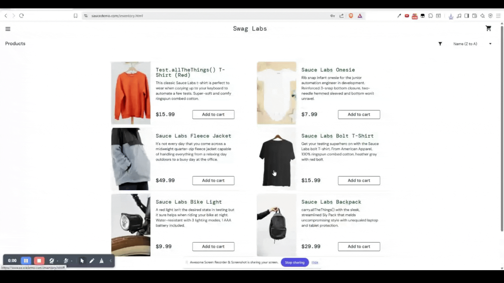

# BUG-04: Refreshing Page Resets Item Sorting

## Bug Metadata

| Field                | Value            |
| -------------------- | ---------------- |
| **Status**           | 🔴 Open          |
| **Reported By**      | Afope            |
| **Date Created**     | 2025-12-14       |
| **Last Updated**     | 2025-12-14       |
| **Severity**         | 🟢 Low           |
| **Priority**         | P3               |
| **Affected Feature** | Item Sorting     |
| **Bug Type**         | State Management |
| **Traceability**     | TC-INVENTORY-003 |

## Environment Details

| Component            | Version/Details                          |
| -------------------- | ---------------------------------------- |
| **Browser**          | Brave 1.84.141                           |
| **Operating System** | Windows 11                               |
| **URL**              | https://www.saucedemo.com/inventory.html |
| **User Account**     | `standard_user`                          |

## Preconditions

- User is **logged in** as `standard_user`
- User is on the [Inventory Page](https://www.saucedemo.com/inventory.html)
- Items are currently sorted by **name (Z -> A)**

## Test Data

```
N/A
```

## Steps to Reproduce

### Expected Behaviour

| Step | Action                                              | Expected Result                                             |
| ---- | --------------------------------------------------- | ----------------------------------------------------------- |
| 1    | Refresh the page (F5 or browser refresh button)     | Page reloads successfully                                   |
| 2    | Verify the **Selected Sort Option** in the dropdown | Sort dropdown displays: `Name (Z → A)`                      |
| 3    | Verify the **First Item** in the inventory list     | **First Item** matches: `Test.allTheThings() T-Shirt (Red)` |
| 4    | Verify the **Last Item** in the inventory list      | **Last Item** matches: `Sauce Labs Backpack`                |

### Actual Behaviour

| Step | Action                                              | Actual Result                                                      |
| ---- | --------------------------------------------------- | ------------------------------------------------------------------ |
| 1    | Refresh the page (F5 or browser refresh button)     | Page reloads successfully                                          |
| 2    | Verify the **Selected Sort Option** in the dropdown | Sort dropdown displays: `Name (A → Z)`                             |
| 3    | Verify the **First Item** in the inventory list     | **First Item** does not match: `Test.allTheThings() T-Shirt (Red)` |
| 4    | Verify the **Last Item** in the inventory list      | **Last Item** does not match: `Sauce Labs Backpack`                |

## Evidence


