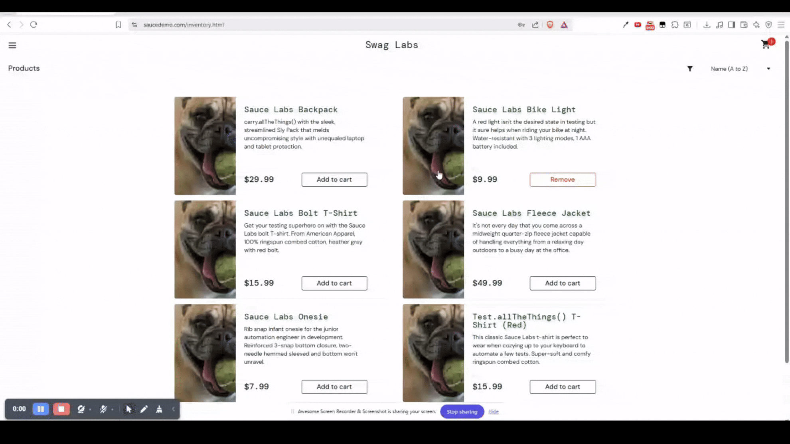

# BUG-05: Remove Button Does Not Remove Item From Cart

## Bug Metadata

| Field                | Value            |
| -------------------- | ---------------- |
| **Status**           | 🔴 Open          |
| **Reported By**      | Afope            |
| **Date Created**     | 2025-12-14       |
| **Last Updated**     | 2025-12-14       |
| **Severity**         | 🔴 High          |
| **Priority**         | P2               |
| **Affected Feature** | Cart             |
| **Bug Type**         | Functional       |
| **Traceability**     | TC-INVENTORY-005 |

## Environment Details

| Component            | Version/Details                          |
| -------------------- | ---------------------------------------- |
| **Browser**          | Brave 1.84.141                           |
| **Operating System** | Windows 11                               |
| **URL**              | https://www.saucedemo.com/inventory.html |
| **User Account**     | `problem_user`                           |

## Preconditions

- User is **logged in** as `problem_user`
- User is on the [Inventory Page](https://www.saucedemo.com/inventory.html)
- Cart contains `Sauce Labs Backpack`

## Test Data

```
N/A
```

## Steps to Reproduce

### Expected Behaviour

| Step | Action                                               | Expected Result                                                      |
| ---- | ---------------------------------------------------- | -------------------------------------------------------------------- |
| 1    | Locate `Sauce Labs Backpack` in inventory list       | Item is visible and item has **Remove** button                       |
| 2    | Click the **Remove** button on `Sauce Labs Backpack` | Item is removed from cart and button text changes to **Add to Cart** |
| 3    | Verify **Cart Indicator** count                      | **Cart indicator** decreases to `0`                                  |
| 4    | Click the **Cart Icon** at the top right corner      | User is navigated to the `Cart page`                                 |
| 5    | Verify `Sauce Labs Backpack` is not in the cart      | Cart is empty with no items displayed                                |

### Actual Behaviour

| Step | Action                                               | Actual Result                                           |
| ---- | ---------------------------------------------------- | ------------------------------------------------------- |
| 1    | Locate `Sauce Labs Backpack` in inventory list       | Item is visible and item has **Remove** button          |
| 2    | Click the **Remove** button on `Sauce Labs Backpack` | Item is remains in cart and button text does not change |
| 3    | Verify **Cart Indicator** count                      | **Cart indicator** remains `1`                          |
| 4    | Click the **Cart Icon** at the top right corner      | User is remains to the `Cart page`                      |
| 5    | Verify `Sauce Labs Backpack` is not in the cart      | Cart contains exactly one item: `Sauce Labs Backpack`   |

## Evidence


