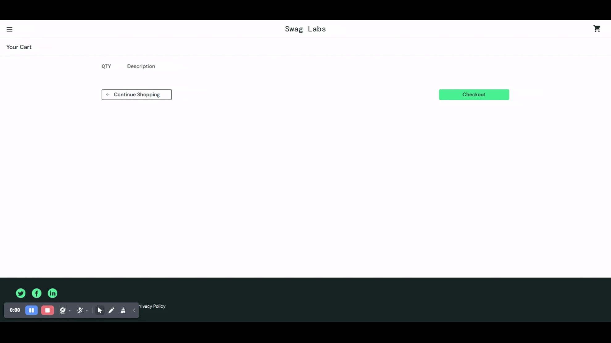

# BUG-006: Checkout Process Succeeds With an Empty Cart

## Bug Metadata

| Field                | Value           |
| -------------------- | --------------- |
| **Status**           | 🔴 Open         |
| **Reported By**      | Afope           |
| **Date Created**     | 2025-12-14      |
| **Last Updated**     | 2025-12-14      |
| **Severity**         | 🔴 High         |
| **Priority**         | P2              |
| **Affected Feature** | Checkout        |
| **Bug Type**         | Cart Validation |
| **Traceability**     | TC-CART-003     |

## Environment Details

| Component            | Version/Details                     |
| -------------------- | ----------------------------------- |
| **Browser**          | Brave 1.85.111                      |
| **Operating System** | Windows 11                          |
| **URL**              | https://www.saucedemo.com/cart.html |
| **User Account**     | `problem_user`                      |

## Preconditions

- User is **logged in** as `problem_user`
- User is on the [Cart Page](https://www.saucedemo.com/cart.html)
- Cart is **empty** (cart indicator displays `0`)

## Test Data

```
N/A
```

## Steps to Reproduce

### Expected Behaviour

| Step | Action                        | Expected Result                                                              |
| ---- | ----------------------------- | ---------------------------------------------------------------------------- |
| 1    | Click the **checkout** button | Error message displayed: `Your Cart is Empty, Add Items from Inventory page` |

### Actual Behaviour

| Step | Action                        | Actual Result                                    |
| ---- | ----------------------------- | ------------------------------------------------ |
| 1    | Click the **Checkout** button | User is navigated to **Checkout: Step One** page |

## Evidence


