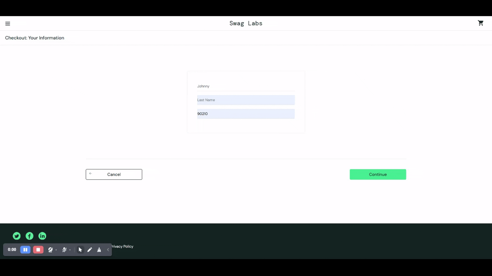

# BUG-008: Checkout Step One Form Does Not Retain Data

## Bug Metadata

| Field                | Value                      |
| -------------------- | -------------------------- |
| **Status**           | 🔴 Open                    |
| **Reported By**      | Afope                      |
| **Date Created**     | 2025-12-14                 |
| **Last Updated**     | 2025-12-14                 |
| **Severity**         | 🔴 High                    |
| **Priority**         | P2                         |
| **Affected Feature** | Checkout Step One          |
| **Bug Type**         | Form Handling / Functional |
| **Traceability**     | TC-CHECKOUT-003            |

## Environment Details

| Component            | Version/Details                                  |
| -------------------- | ------------------------------------------------ |
| **Browser**          | Brave 1.85.111                                   |
| **Operating System** | Windows 11                                       |
| **URL**              | https://www.saucedemo.com/checkout-step-one.html |
| **User Account**     | `problem_user`                                   |

## Preconditions

- User is **logged in** as `problem_user`
- `Sauce Labs Onesie` has been added to the cart
- User is on the [Checkout Step One Page](https://www.saucedemo.com/checkout-step-one.html)

## Test Data

```
First Name: `Johnny`
Last Name: `Bravo`
Zip/Postal Code: `M5A M5V`
```

## Steps to Reproduce

### Expected Behaviour

| Step | Action                                       | Expected Result                                                              |
| ---- | -------------------------------------------- | ---------------------------------------------------------------------------- |
| 1    | Enter `Johnny` in **First Name** field       | **First Name** field displays the entered text correctly with no errors      |
| 2    | Enter `Bravo` in **Last Name** field         | **Last Name** field displays the entered text correctly with no errors       |
| 3    | Enter `M5A M5V` in **Zip/Postal Code** field | **Zip/Postal Code** field displays the entered text correctly with no errors |
| 4    | Click the `Continue` button                  | User is navigated to `Checkout Step Two Page`                                |

### Actual Behaviour

| Step | Action                                       | Actual Result                                                                |
| ---- | -------------------------------------------- | ---------------------------------------------------------------------------- |
| 1    | Enter `Johnny` in **First Name** field       | **First Name** field displays the entered text correctly with no errors      |
| 2    | Enter `Bravo` in **Last Name** field         | **Last Name** field does not display the entered text                        |
| 3    | Enter `M5A M5V` in **Zip/Postal Code** field | **Zip/Postal Code** field displays the entered text correctly with no errors |
| 4    | Click the `Continue` button                  | User is navigated to `Checkout Step Two Page`                                |

## Evidence


