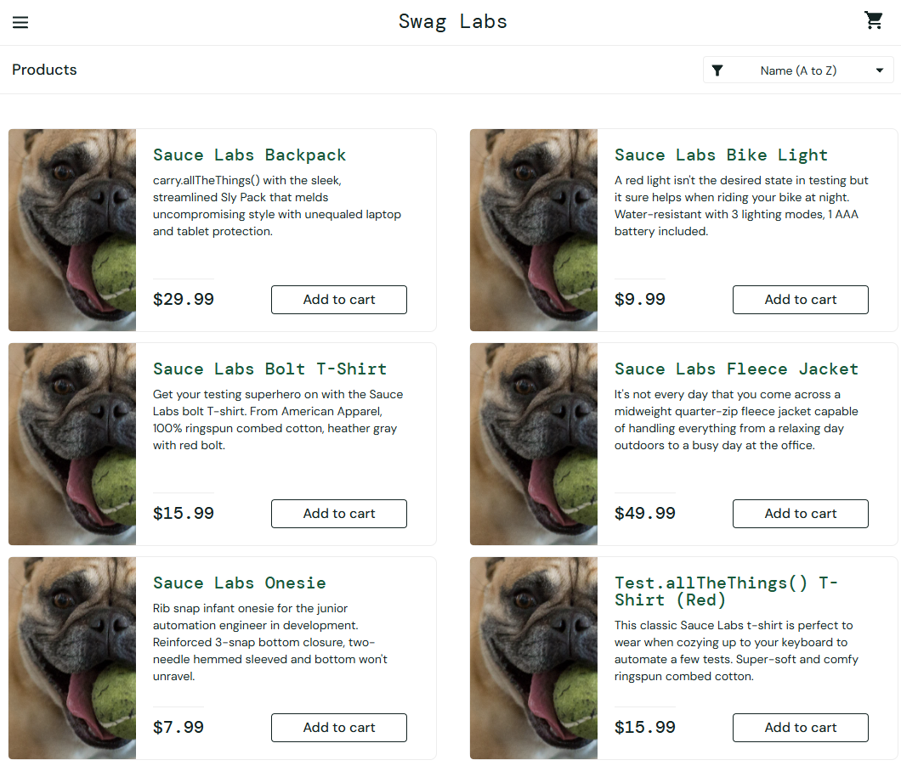

# BUG-02: Inventory Items Display Incorrect Product Details

## Bug Metadata

| Field                | Value                |
| -------------------- | -------------------- |
| **Status**           | 🔴 Open              |
| **Reported By**      | Afope                |
| **Date Created**     | 2025-12-14           |
| **Last Updated**     | 2025-12-14           |
| **Severity**         | 🟡 Medium            |
| **Priority**         | P2                   |
| **Affected Feature** | Inventory Management |
| **Bug Type**         | Data Mapping         |
| **Tracability**      | TC-INVENTORY-001     |

## Environment Details

| Component            | Version/Details                          |
| -------------------- | ---------------------------------------- |
| **Browser**          | Brave 1.84.141                           |
| **Operating System** | Windows 11                               |
| **URL**              | https://www.saucedemo.com/inventory.html |
| **User Account**     | `problem_user`                           |

## Preconditions

- User is **logged in** with `problem_user`
- User is on the [Inventory Page](https://www.saucedemo.com/inventory.html)

## Test Data

```
Item Name: `Sauce Labs Bike Light`
Item Image: `Bike Light`
Item Price: `$9.99`
Item Description: `A red light isn't the desired state in...`

Item Name: `Sauce Labs Backpack`
Item Image: `Backpack`
Item Price: `$29.99`
Item Description: `carry.allTheThings() with the sleek...`
```

## Steps to Reproduce

### Expected Behaviour

| Step | Action                                                       | Expected Result                                                                             |
| ---- | ------------------------------------------------------------ | ------------------------------------------------------------------------------------------- |
| 1    | Locate `Sauce Labs Bike Light` in inventory list             | Item is visible in the inventory                                                            |
| 2    | Verify the **Details** displayed for `Sauce Labs Bike Light` | Description matches: `A red light isn't the desired state in...` and Price matches: `$9.99` |
| 3    | Verify the **Image** displayed for `Sauce Labs Bike Light`   | Image matches: `Bike Light`                                                                 |
| 4    | Locate `Sauce Labs Backpack` in inventory list               | Item is visible in the inventory                                                            |
| 5    | Verify the **Image** displayed for `Sauce Labs Backpack`     | Image matches: `Backpack`                                                                   |
| 6    | Verify the **Details** displayed for `Sauce Labs Backpack`   | Description matches: `carry.allTheThings() with the sleek...` and Price matches: `$29.99`   |

### Actual Behaviour

| Step | Action                                                       | Expected Result                                                                             |
| ---- | ------------------------------------------------------------ | ------------------------------------------------------------------------------------------- |
| 1    | Locate `Sauce Labs Bike Light` in inventory list             | Item is visible in the inventory                                                            |
| 2    | Verify the **Details** displayed for `Sauce Labs Bike Light` | Description matches: `A red light isn't the desired state in...` and Price matches: `$9.99` |
| 3    | Verify the **Image** displayed for `Sauce Labs Bike Light`   | Image matches: `Bulldog with Tennis ball`                                                   |
| 4    | Locate `Sauce Labs Backpack` in inventory list               | Item is visible in the inventory                                                            |
| 5    | Verify the **Image** displayed for `Sauce Labs Backpack`     | Image matches: `Bulldog with Tennis ball`                                                   |
| 6    | Verify the **Details** displayed for `Sauce Labs Backpack`   | Description matches: `carry.allTheThings() with the sleek...` and Price matches: `$29.99`   |

## Evidence


