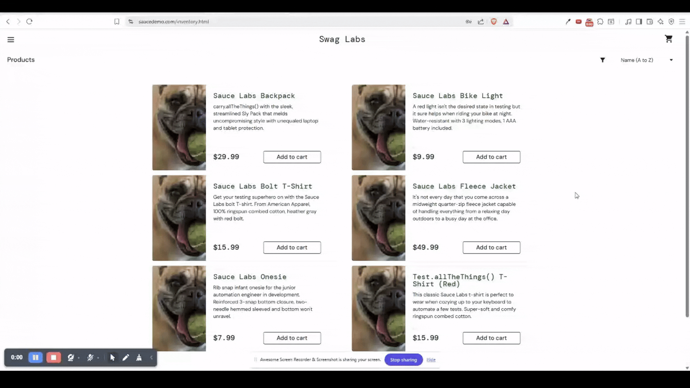

# BUG-003: Item Sorting by Name (Z → A) Fails

## Bug Metadata

| Field                | Value            |
| -------------------- | ---------------- |
| **Status**           | 🔴 Open          |
| **Reported By**      | Afope            |
| **Date Created**     | 2025-12-14       |
| **Last Updated**     | 2025-12-14       |
| **Severity**         | 🟢 Low           |
| **Priority**         | P3               |
| **Affected Feature** | Product Sorting  |
| **Bug Type**         | Functional       |
| **Traceability**     | TC-INVENTORY-002 |

## Environment Details

| Component            | Version/Details                          |
| -------------------- | ---------------------------------------- |
| **Browser**          | Brave 1.84.141                           |
| **Operating System** | Windows 11                               |
| **URL**              | https://www.saucedemo.com/inventory.html |
| **User Account**     | `problem_user`                           |

## Preconditions

- User is **logged in** with `problem_user`
- User is on the [Inventory Page](https://www.saucedemo.com/inventory.html)

## Test Data

```
Sort Order: `Name (Z → A)`
```

## Steps to Reproduce

### Expected Behaviour

| Step | Action                                          | Expected Result                                             |
| ---- | ----------------------------------------------- | ----------------------------------------------------------- |
| 1    | Click the **Sort** dropdown                     | Dropdown menu opens displaying 4 sorting options            |
| 2    | Select the **Name (Z → A)** option              | Items are reordered by **Name (Z → A)**                     |
| 3    | Verify the **First Item** in the inventory list | **First Item** matches: `Test.allTheThings() T-Shirt (Red)` |
| 4    | Verify the **Last Item** in the inventory list  | **Last Item** matches: `Sauce Labs Backpack`                |

### Actual Behaviour

| Step | Action                                          | Actual Result                                                     |
| ---- | ----------------------------------------------- | ----------------------------------------------------------------- |
| 1    | Click the **Sort** dropdown                     | Dropdown menu opens displaying 4 sorting options                  |
| 2    | Select the **Name (Z → A)** option              | Items remained the same                                           |
| 3    | Verify the **First Item** in the inventory list | **First Item** did not match: `Test.allTheThings() T-Shirt (Red)` |
| 4    | Verify the **Last Item** in the inventory list  | **Last Item** did not match: `Sauce Labs Backpack`                |

## Evidence


